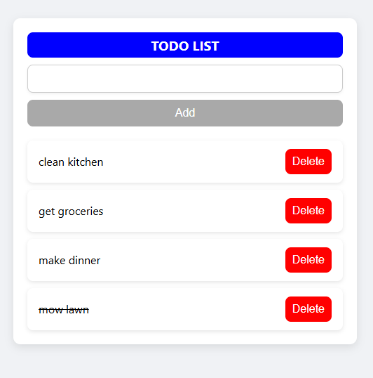

📌 Description
TODO-APP is a full-stack task management application built with the MERN stack (MongoDB, Express, React, Node.js). It enables users to create, manage, and track daily tasks through a clean, responsive, and intuitive interface. Designed with productivity in mind, the app features persistent storage, complete CRUD functionality, and real-time interaction between client and server.

This project demonstrates end-to-end full-stack development, with a strong focus on backend architecture, frontend responsiveness, and RESTful API design.

🚀 Live Demo
🚧 Deployment in progress...
📽️ Watch demo video (coming soon)
🔗 Link to deployed app will go here

📸 Preview




⚙️ Features

    📝 Create, update, complete, and delete to-dos

    🎯 Mark items as complete/incomplete

    💾 Persistent storage via MongoDB

    🔄 Real-time updates using Axios

    📱 Responsive layout for desktop and mobile

    🔐 (Planned) User authentication with JWT

    🏷️ (Planned) Categorize and filter tasks


🛠️ Tech Stack

Frontend

    React 19 (Hooks, Functional Components)

    Axios for API communication

    React Router DOM for navigation

    React Icons for UI enhancement

Backend

    Node.js & Express.js

    MongoDB with Mongoose for schema modeling

    CORS & dotenv for cross-origin and environment config


📂 Project Structure
```bash
TODO-APP/
├── frontend/
│   ├── public/
│   ├── src/
│   │   ├── components/
│   │   │   ├── TodoList.js
│   │   │   └── TodoItem.js
│   │   ├── pages/
│   │   │   └── Home.js
│   │   ├── App.js
│   │   ├── App.css
│   │   ├── index.js
│   │   └── index.css
├── backend/
│   ├── models/
│   │   └── Todo.js
│   ├── routes/
│   │   └── todoRoutes.js
│   ├── server.js
│   └── .env (excluded)
├── assets/
│   └── TODO-APP-preview.png
└── README.md
```

🧪 Setup Instructions

📦 Prerequisites

    Node.js & npm installed

    MongoDB running locally or MongoDB Atlas account

🚀 Installation Steps

1.  Clone the repository

```bash
git clone https://github.com/tobyanderson1983/TODO-APP.git
cd TODO-APP
```

2. Install dependencies for frontend and backend

```bash
cd frontend && npm install
cd ../backend && npm install
```

3. Configure backend environment Create a .env file in /backend/:

MONGO_URI=mongodb://localhost:27017/todos
PORT=5000

4. Run the backend server

```bash
cd ../backend
npm run dev
```

5. Run the frontend app

```bash
cd ../frontend
npm start
```

🧭 Roadmap

- [ ] Add user authentication (register/login)
- [ ] Deploy frontend (Netlify/Vercel)
- [ ] Deploy backend (Render/Heroku)
- [ ] Add edit functionality for todos
- [ ] Add filtering and tags for task categorization
- [ ] Add due dates or priorities


🧠 What I Learned

- 🏗️ Designed a full-stack MERN architecture from scratch

- 🔌 Built RESTful APIs using Express and Mongoose

- 🔐 Connected frontend and backend securely via Axios

- ⚛️ Managed state with React Hooks

- ⏳ Handled async operations and UI state

- 📁 Structured scalable and maintainable project folders


🙌 Credits

    Built with 💻 and ☕ by Toby Anderson
    Feel free to reach out or fork this repo for your own learning!

📄 License

    This project is licensed under the MIT License — free to use and modify.

